# Bellevue Data Cycle — Architecture

End-to-end data flow for the HES-SO Bellevue campus energy-monitoring pipeline.
On-premises sources are ingested daily into an Azure Medallion Lakehouse,
transformed by Databricks, scored by a KNIME ML server, and served to SAP
Analytics Cloud and Power BI.

---

## 1. End-to-End Data Flow

```mermaid
flowchart TB
    %% =========================================================
    %% ON-PREMISES SOURCES
    %% =========================================================
    subgraph SRC["🏢 ON-PREMISES — HES-SO Bellevue Campus"]
        direction LR
        SMB1[("📁 SMB · BellevueBooking<br/><i>TSV room bookings</i>")]
        SMB2[("📁 SMB · BellevueConso<br/><i>UTF-16 energy / temp / humidity</i>")]
        SMB3[("📁 SMB · Solarlogs<br/><i>Sungrow inverter CSVs</i>")]
        SFTP[("🔐 SFTP · Weather<br/><i>historical + 3 h forecast</i>")]
    end

    SHIR["🛡️ <b>Self-Hosted Integration Runtime</b><br/>Group3-VM-Runtime · Windows VM 10.130.25.152"]
    SMB1 --> SHIR
    SMB2 --> SHIR
    SMB3 --> SHIR
    SFTP --> SHIR

    %% =========================================================
    %% INGESTION  (ADF, 07:15)
    %% =========================================================
    subgraph ADF1["⚙️ INGESTION — Azure Data Factory · group3-df &nbsp;&nbsp;⏰ TRG_Daily_0715"]
        direction TB
        MASTER["📋 <b>PL_Ingest_Bronze</b><br/><i>master orchestrator</i>"]
        subgraph PAR["parallel sub-pipelines · GetMetadata → Filter → ForEach Copy"]
            direction LR
            P1["PL_Bronze_Solar"]
            P2["PL_Bronze_Bookings"]
            P3["PL_Bronze_Meteo"]
            P4["PL_Bronze_Conso"]
        end
        MASTER --> PAR
    end
    SHIR --> MASTER

    %% =========================================================
    %% BRONZE
    %% =========================================================
    BRONZE[("🥉 <b>BRONZE</b> · ADLS Gen2 — adlsbellevuegrp3<br/><i>raw CSV (UTF-8 / UTF-16 LE)<br/>solar · bookings · meteo · consumption · …</i>")]
    PAR --> BRONZE

    %% =========================================================
    %% SILVER  (Databricks)
    %% =========================================================
    NB1["📓 <b>silver_transformation.py</b><br/><i>UTF-16 BOM / null cleanup · solar unpivot (5 inverters)<br/>counter-reset deltas · synthetic Sierre weather (avg Sion+Visp)<br/>SHA-256 GDPR masking · lag-based deltas</i>"]
    BRONZE --> NB1

    SILVER[("🥈 <b>SILVER</b> · ADLS Gen2 · Parquet<br/><i>cleaned / typed / deduplicated</i>")]
    NB1 --> SILVER

    %% =========================================================
    %% GOLD BUILD  (Databricks → Azure SQL)
    %% =========================================================
    subgraph GLDBUILD["🏗️ GOLD BUILD — Azure Databricks"]
        direction LR
        NB2["📓 <b>silver_gold_dimensions.py</b><br/><i>idempotent MERGE (LEFT ANTI JOIN) · 8 dims</i>"]
        NB3["📓 <b>silver_gold_facts.py</b><br/><i>watermark incremental load · 7 facts<br/>JDBC append + retry/backoff (serverless pause)</i>"]
        NB2 -. blocks .-> NB3
    end
    SILVER --> NB2
    SILVER --> NB3

    GOLD[("🥇 <b>GOLD</b> · Azure SQL — DevDB<br/>sqlserver-bellevue-grp3 (serverless Gen5)<br/><i>8 dims · 7 facts · 7 analytical views</i>")]
    NB2 --> GOLD
    NB3 --> GOLD

    %% =========================================================
    %% ML LOOP  (09:30)
    %% =========================================================
    subgraph MLOOP["🤖 ML PIPELINE &nbsp;&nbsp;⏰ TRG_Daily_0930 — PL_Upload_Pred_Gold"]
        direction TB
        NB4["📓 <b>ml_export_to_knime.py</b><br/><i>feature engineering · 3 h → 15 min interpolation<br/>room-occupation %</i>"]
        MLIN[("📁 mldata/knime_input/<br/><i>solar + consumption CSV</i>")]
        KNIME["☁️ <b>KNIME Server</b> (REST)<br/>Data_Preparation · <i>Model_Selection (Mon)</i><br/>Solar predictor ‖ Consumption predictor<br/><i>Gradient Boosted Trees</i>"]
        MLOUT[("📁 mldata/knime_output/<br/><i>predictions CSV</i>")]
        NB5["📓 <b>ml_load_predictions.py</b><br/><i>idempotent DELETE→INSERT<br/>sp_backfill_prediction_actuals · config write-back</i>"]
        NB4 --> MLIN --> KNIME --> MLOUT --> NB5
    end
    SILVER -. feature read .-> NB4
    NB5 ==>|fact_energy_prediction| GOLD

    %% =========================================================
    %% SERVING
    %% =========================================================
    subgraph SERVE["📊 SERVING & CONSUMPTION"]
        direction LR
        NB6["📓 sac_export_to_adls.py"]
        SACEXP[("📁 sacexport/ · CSV")]
        SACCOPY["⚙️ PL_SAC_Export"]
        FILESHARE[("📂 Azure File Share<br/>sac-export-share")]
        SAC["🟢 <b>SAP Analytics Cloud</b>"]
        PBI["🟡 <b>Power BI</b><br/><i>3 reports / templates</i>"]
        NB6 --> SACEXP --> SACCOPY --> FILESHARE --> SAC
    end
    GOLD --> NB6
    GOLD ==>|7 analytical views · RLS-filtered| PBI

    %% =========================================================
    %% CROSS-CUTTING
    %% =========================================================
    subgraph CROSS["🔐 SECURITY · GOVERNANCE · OPS"]
        direction LR
        KV["🔑 <b>Key Vault</b><br/>DataCycleGroup3Keys<br/><i>SQL · DBX PAT · KNIME · ADLS · SHIR</i>"]
        UAMI["🪪 <b>User-Assigned MI</b><br/>gh-datacycle-oidc<br/><i>OIDC federated to GitHub</i>"]
        RLS["🛂 <b>SQL RBAC + RLS</b><br/>Director_Role · Technician_Role<br/><i>BookingDivisionFilter (GDPR)</i>"]
        ALERT["🚨 <b>Action Group</b><br/>ar-pl-ingest-bronze-failed<br/><i>1-hour SLA</i>"]
        CICD["🔄 <b>GitHub Actions</b><br/>validate.yml · deploy-adf.yml<br/><i>OIDC, no client secrets</i>"]
        IAC["🏗️ <b>Bicep IaC</b><br/><i>infrastructure/ — full-rebuild runbook</i>"]
    end
    KV -. secrets .-> ADF1
    KV -. secrets .-> NB1
    KV -. secrets .-> GLDBUILD
    KV -. secrets .-> MLOOP
    UAMI -. auth .-> ADF1
    CICD -. deploys .-> ADF1
    ADF1 -. failure .-> ALERT
    GOLD -. enforces .-> RLS

    %% =========================================================
    %% STYLING
    %% =========================================================
    classDef src       fill:#E3F2FD,stroke:#1976D2,stroke-width:2px,color:#0D47A1
    classDef gateway   fill:#FFF3E0,stroke:#EF6C00,stroke-width:2px,color:#3E2723
    classDef adf       fill:#E1F5FE,stroke:#0277BD,stroke-width:2px,color:#01579B
    classDef bronze    fill:#FFE0B2,stroke:#E65100,stroke-width:3px,color:#3E2723
    classDef silver    fill:#ECEFF1,stroke:#455A64,stroke-width:3px,color:#212121
    classDef gold      fill:#FFF8E1,stroke:#FFA000,stroke-width:3px,color:#5D4037
    classDef dbx       fill:#FFEBEE,stroke:#C62828,stroke-width:2px,color:#B71C1C
    classDef ml        fill:#F3E5F5,stroke:#7B1FA2,stroke-width:2px,color:#4A148C
    classDef serve     fill:#E8F5E9,stroke:#2E7D32,stroke-width:2px,color:#1B5E20
    classDef sec       fill:#FFFDE7,stroke:#F57F17,stroke-width:1px,color:#3E2723

    class SMB1,SMB2,SMB3,SFTP src
    class SHIR gateway
    class MASTER,P1,P2,P3,P4,SACCOPY adf
    class BRONZE bronze
    class SILVER silver
    class GOLD gold
    class NB1,NB2,NB3,NB4,NB5,NB6 dbx
    class MLIN,MLOUT,KNIME ml
    class SACEXP,FILESHARE,SAC,PBI serve
    class KV,UAMI,RLS,ALERT,CICD,IAC sec
```

---

## 2. Daily Orchestration Timeline

```mermaid
gantt
    title Two daily triggers · all activities deterministic in ADF
    dateFormat HH:mm
    axisFormat %H:%M

    section TRG_Daily_0715 — Refresh
    PL_Ingest_Bronze (4 parallel sub-pipelines)            :a1, 07:15, 30m
    silver_transformation                                  :a2, after a1, 30m
    silver_gold_dimensions ‖ ml_export_to_knime            :a3, after a2, 20m
    silver_gold_facts                                      :a4, after a3, 30m
    PL_SAC_Export → Azure File Share                       :a5, after a4, 15m

    section TRG_Daily_0930 — ML Inference
    Data_Preparation                                       :b1, 09:30, 5m
    Model_Selection (Mondays only)                         :b2, after b1, 10m
    Solar predictor ‖ Consumption predictor                :b3, after b2, 15m
    ml_load_predictions + sp_backfill_prediction_actuals   :b4, after b3, 10m
```

---

## 3. Layer Reference

| Layer | Storage | Format | Owner | Trigger |
|---|---|---|---|---|
| 🥉 **Bronze** | ADLS Gen2 `bronze/` | raw CSV (mixed encodings) | ADF `PL_Bronze_*` | `TRG_Daily_0715` |
| 🥈 **Silver** | ADLS Gen2 `silver/` | Parquet | DBX `silver_transformation.py` | `TRG_Daily_0715` |
| 🥇 **Gold** | Azure SQL `DevDB` | tables + views | DBX `silver_gold_*.py` | `TRG_Daily_0715` |
| 🤖 **ML data** | ADLS Gen2 `mldata/` | CSV | DBX `ml_export_to_knime.py` → KNIME → DBX `ml_load_predictions.py` | `TRG_Daily_0930` |
| 📤 **SAC export** | ADLS Gen2 `sacexport/` → Azure File Share | CSV | DBX `sac_export_to_adls.py` + ADF `PL_SAC_Export` | `TRG_Daily_0715` |
| ⚙️ **Config** | ADLS Gen2 `config/` | JSON | manual + ML write-back | n/a |
