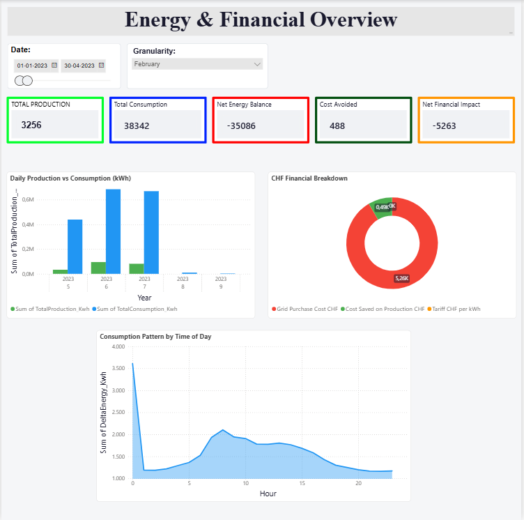
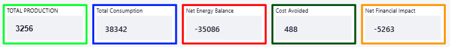
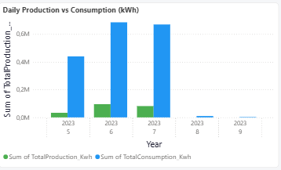
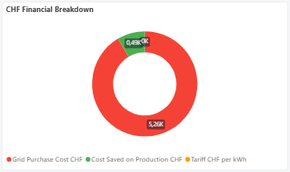
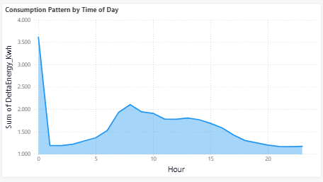

# User Handbook: Energy & Financial Overview — Power BI Dashboard

> Part of the [Solar Inverter Operations & Performance Dashboard](../README.md) project.  
> See also: [Solar Inverter Dashboard Guide](USER_HANDBOOK_DASHBOARD.md) · [Room Occupancy Dashboard Guide](USER_HANDBOOK_ROOM_OCCUPANCY.md) · [SAC Dashboard Guide](USER_HANDBOOK_SAC_DASHBOARD.md) · [Data Privacy & GDPR Statement](DATA_PRIVACY_GDPR.md) · [Technical Guide](TECHNICAL_GUIDE.md) · [Wiki](https://github.com/sandersdHES/ADF_DataCycleProject/wiki)

**Power BI Dashboard · US22 · Sprint 5**

---

This handbook provides a practical guide on how to navigate and interpret the **Energy & Financial Overview** dashboard in Power BI. It is intended for data analysts and building managers who need to monitor solar energy production, building consumption, and financial performance in CHF.

---

## 1. Data Controls & Navigation

At the top of the dashboard you will find two controls that drive all the visuals on the page. Any change you make here updates all charts and KPI cards instantly.

### Date Range Selector

The date picker lets you choose the start and end of the observation period. Click on the start date field, type or pick a date, then repeat for the end date. All charts and cards on the page update automatically.

- **Data source:** `FullDate` column from `vw_daily_energy_balance`
- **Tip:** Narrow the range to a single month to focus on short-term trends, or open it to a full year for a strategic view.

### Granularity Selector

The three tile buttons — **Daily**, **Monthly**, and **Weekly** — control the level of detail shown in the bar chart. Click one button at a time; only one granularity can be active at once.

| Button | Best used for |
|---|---|
| **Daily** | Spotting specific anomalies or events on a given day |
| **Weekly** | Comparing workload patterns by calendar week |
| **Monthly** | High-level strategic and financial reporting |

---

## 2. KPI Summary Cards

The five cards across the top of the dashboard provide an instant snapshot of the most important figures for the selected period. Each card is colour-coded with a border and uses a DAX measure from the `_Measures` table (Home KPI folder) to calculate its value.

### Total Production · *green border*

The total energy generated by the solar panels during the selected period, in kWh.

- **Measure:** `Total Production kWh` (from `_Measures → Home KPI`)
- **Source data:** `fact_solar_production → DeltaEnergy_Kwh`

### Total Consumption · *blue border*

The total energy consumed by the building during the same period, in kWh. This includes all electrical loads: lighting, HVAC, and equipment.

- **Measure:** `Total Consumption kWh` (from `_Measures → Home KPI`)
- **Source data:** `fact_energy_consumption → DeltaEnergy_Kwh`

> **Note:** If Total Consumption is significantly higher than Total Production, the building is drawing most of its energy from the grid.

### Net Energy Balance · *red border*

The difference between production and consumption (Production minus Consumption), in kWh. A negative value means the building consumed more than it produced and had to purchase energy from the grid.

- **Measure:** `Net Energy Balance kWh` (from `_Measures → Home KPI`)

### Cost Avoided · *dark green border*

The amount of money saved in CHF because solar energy was used directly instead of purchasing from the grid. Calculated as `Production × tariff rate (0.25 CHF/kWh)` from `ref_electricity_tariff`.

- **Measure:** `Cost Avoided CHF` (from `_Measures → Home KPI`)
- **Tariff reference:** `ref_electricity_tariff → PricePerKwh_CHF`

### Net Financial Impact · *orange border*

The overall financial result in CHF, combining solar savings with grid purchase costs. A negative value means grid costs exceeded savings during the selected period.

- **Measure:** `Net Financial Impact CHF` (from `_Measures → Home KPI`)

---

## 3. Daily Production vs Consumption

The bar chart on the left side of the dashboard compares solar energy production (green bars) against building consumption (blue bars) over time. The X-axis shows the year and calendar week; the Y-axis shows energy in kWh.

### Data sources

| Axis | Data |
|---|---|
| Y-axis — green | `TotalProduction_Kwh` from `vw_daily_energy_balance` |
| Y-axis — blue | `TotalConsumption_Kwh` from `vw_daily_energy_balance` |
| X-axis | `Year` and `WeekOfYear` from `dim_date` (linked via `FullDate` relationship) |

### How to read it

| Bar | Meaning |
|---|---|
| 🟢 Green bars | Solar production for that week — taller bars mean more energy was generated |
| 🔵 Blue bars | Building consumption for that week — generally more consistent than production |
| Green > Blue | The building was self-sufficient and may have exported energy |
| Blue > Green | The building purchased additional energy from the grid |

### What to look for

- **Sudden drops in production** may indicate an inverter fault or adverse weather.
- **Consumption spikes** may reflect increased occupancy or equipment running outside normal hours.
- **A consistent gap** between the two bars shows a structural dependency on the grid.

---

## 4. CHF Financial Breakdown

The donut chart on the right side of the dashboard splits the financial picture into three segments to show where money was saved and where it was spent during the selected period.

### Segments

| Colour | Segment | Measure |
|---|---|---|
| 🟢 Green | **Savings** — CHF value of solar energy used directly instead of purchased from the grid | `Cost Saved on Production CHF` (from `_Measures → Energy & Financial`) |
| 🔴 Red | **Grid cost** — Amount spent purchasing energy from the grid during the period | `Grid Purchase Cost CHF` (from `_Measures → Energy & Financial`) |
| 🟠 Orange | **Tariff reference** — Reference electricity rate used in calculations (0.25 CHF/kWh) | `Tariff CHF per kWh` (from `_Measures → Shared / Global`) |

### How to interpret it

In an ideal scenario, the **green segment (Savings)** should be the largest, meaning solar production is covering a significant portion of the building's costs. If the **red segment (Grid cost)** dominates, the building is purchasing more energy than it is saving — which reflects the current situation and accurate consumption data.

---

## 5. Consumption Pattern by Time of Day

The area chart at the bottom right shows how energy consumption is distributed across the hours of the day. The X-axis represents the hour (0 to 21) and the Y-axis shows energy in kWh. This chart is **not affected by the Date Range filter** — it shows an aggregate across all available data.

### Data sources

- **X-axis:** `Hour` from `dim_time`
- **Y-axis:** `DeltaEnergy_Kwh` from `fact_energy_consumption`

### How to read it

| Pattern | Meaning |
|---|---|
| Rise from ~5h–6h | Building becomes active in the morning |
| Peak around 9–10h | Busiest hours of operation |
| Gradual decrease afternoon | Reduced activity through the day |
| Near-zero from 0h–5h | Building mostly inactive at night |

### Operational insight

If the peak shifts to an unusual hour or a secondary spike appears mid-day, this may indicate equipment running outside normal schedules or an automated system activating unexpectedly. Cross-reference with the bar chart and the Date Range filter to identify the specific day.

---

## Related Resources

- [Solar Inverter Dashboard Guide](USER_HANDBOOK_DASHBOARD.md) — guide for the solar production monitoring dashboard
- [Room Occupancy Dashboard Guide](USER_HANDBOOK_ROOM_OCCUPANCY.md) — guide for the room occupancy & utilization dashboard
- [SAC Dashboard Guide](USER_HANDBOOK_SAC_DASHBOARD.md) — guide for the SAP Analytics Cloud Solar Panel Overview
- [Data Privacy & GDPR Statement](DATA_PRIVACY_GDPR.md) — data protection measures and anonymization protocols
- [Technical Guide](TECHNICAL_GUIDE.md) — ETL pipeline, data schema, and ML lifecycle
- [Power BI Dashboards](../dashboards/) — `.pbix` / `.pbit` source files
- [Wiki](https://github.com/sandersdHES/ADF_DataCycleProject/wiki) — full browsable reference
