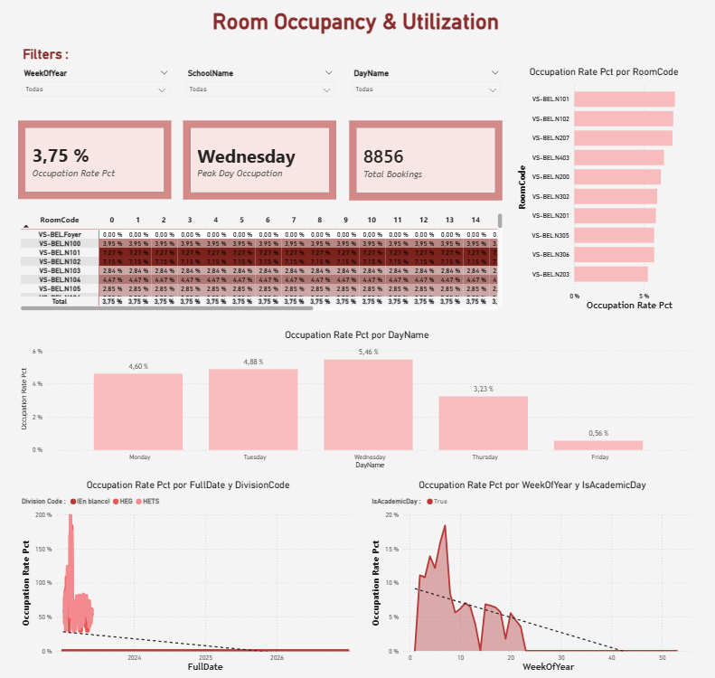
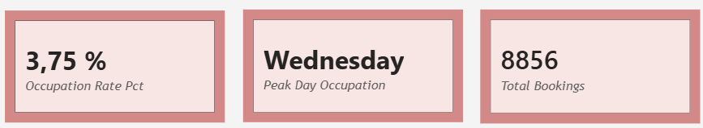
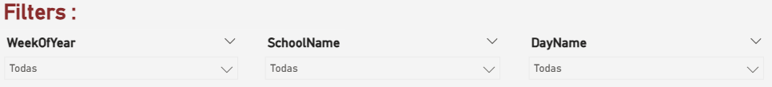
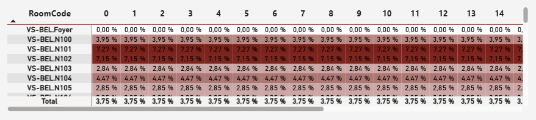
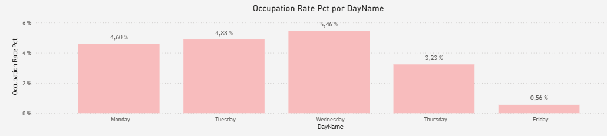
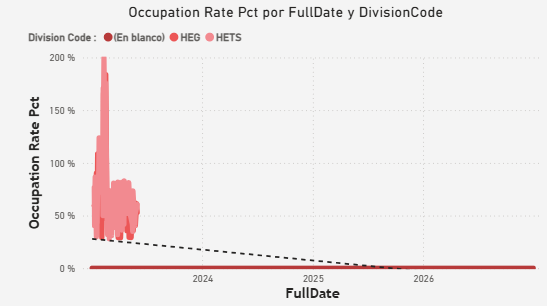
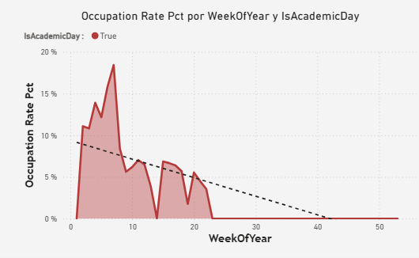
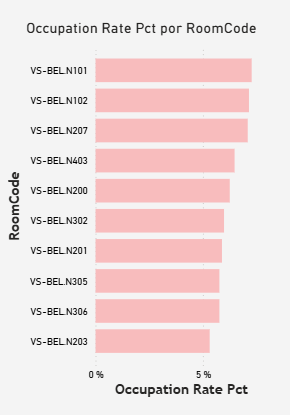

# User Handbook: Room Occupancy & Utilization Dashboard

> Part of the [Solar Inverter Operations & Performance Dashboard](../README.md) project.  
> See also: [Solar Inverter Dashboard Guide](USER_HANDBOOK_DASHBOARD.md) · [Data Privacy & GDPR Statement](DATA_PRIVACY_GDPR.md) · [Technical Guide](TECHNICAL_GUIDE.md) · [Wiki](https://github.com/sandersdHES/ADF_DataCycleProject/wiki)

---

This manual provides a detailed guide on how to navigate and interpret the **Room Occupancy & Utilization** dashboard. It covers every visual component, explains the underlying data logic, and includes interactive tips to get the most out of the report.

---

## 1. Top Filters

> **Technical Setup:** Three drop-down menus mapped to the `WeekOfYear`, `SchoolName`, and `DayName` fields.

At the top of the screen you will see three drop-down menus. These are your filters, allowing you to "travel in time" or focus on a specific area of the data.

| Filter | What it does |
|---|---|
| **WeekOfYear** | Restrict the view to a single week of the academic calendar (e.g., week 15). |
| **SchoolName** | Show only rooms belonging to a specific school — the rest of the dashboard instantly updates. |
| **DayName** | Focus on a specific day of the week (e.g., see only what happens on Fridays). |

> **Tip — The Eraser:** Hover over the top-right corner of any filter to reveal a small eraser icon. Click it to clear your selection and return to the full dataset.

---

## 2. The Big Numbers

> **Technical Setup:** Three independent Card visuals using the `Occupation Rate Pct`, `Peak Day Occupation`, and `Total Bookings` measures.

Right below the filters, three large colored cards give you the most important numbers at a single glance before diving into the details.

| Card | What it shows |
|---|---|
| **Occupation Rate Pct** (Average Occupancy) | The overall percentage of time the rooms are actually being used, based on your current filters. |
| **Peak Day Occupation** (Busiest Day) | Instantly calculates which day of the week has the highest demand (e.g., Wednesday). |
| **Total Bookings** (Volume) | The exact number of room reservations made during the time period you are analysing. |

---

## 3. Room Occupancy by Hour

> **Technical Setup:** Built using a Matrix visual. Rows contain `RoomCode`, columns map to hours of the day (0–23), and conditional formatting is applied to background values.

This detailed table uses colour intensity to show you your daily schedule at a glance.

| Element | Meaning |
|---|---|
| **Rows** | Every specific room available in the building. |
| **Columns (0–23)** | Hours of the day, from midnight (0) to 11:00 PM (23). |
| **Colour intensity** | The darker the red, the busier that room is at that specific hour. |

> **How to use it:** A very dark red block means that room is practically fully booked at that time. If you are looking for a free room to study or a quiet slot to schedule a meeting, look for the lighter or white areas.

---

## 4. Occupancy by Day of the Week

> **Technical Setup:** A column chart plotting `DayName` on the X-Axis and the average `Occupation Rate Pct` on the Y-Axis.

Just below the heatmap, this bar chart reveals the weekly rhythm of the building.

- **The Weekly Trend:** Instantly shows how occupancy fluctuates from Monday to Friday, making it easy to spot the busiest days (e.g., Wednesday at 5.46%) and the quietest days (e.g., Friday at 0.56%).
- **The Exact Numbers:** The percentage label displayed on top of each bar gives you the precise average occupancy rate — no guesswork needed.
- **Interactive Tip:** Click directly on any bar to filter the entire dashboard — including the heatmap and the top cards — to that day only. Click the same bar again to reset to the full week view.

---

## 5. Occupancy Over Time by Division

> **Technical Setup:** Uses `FullDate` on the X-Axis, `Occupation Rate Pct` on the Y-Axis, and `Division Code` in the Legend to separate data series. An analytical Trendline was also added.

Located at the bottom left, this chart shows the "heartbeat" of the building over months and years — perfect for spotting historical trends and busy seasons.

- **The Coloured Lines (Schools/Divisions):** Each colour represents a different Division or School (e.g., HEG or HETS), making it easy to compare which school drives the most room traffic.
- **The Spikes:** When lines shoot up, the building experienced massive demand on those specific dates — sometimes even exceeding 100% when rooms are overbooked or double-booked.
- **The Dashed Black Line (Trendline):** The overall trendline shows the general direction of occupancy. Pointing downward means overall usage is decreasing; pointing upward means demand is growing.
- **Interactive Tip — Hover for Details:** Hover over any peak or valley to reveal a tooltip with the exact date, division, and percentage for that data point.

---

## 6. Occupancy by Week of the Year

> **Technical Setup:** Uses `WeekOfYear` on the X-Axis and `Occupation Rate Pct` on the Y-Axis. The `IsAcademicDay` field is used as the Legend to distinguish term times.

Located at the bottom right, this shaded chart provides a seasonality view — grouping data by the 52 weeks of the year instead of day by day.

- **Mountains and Valleys:** High peaks (e.g., around weeks 7–8) mark the busiest periods of the semester — midterms, project deadlines, or major events. Deep valleys mark quiet weeks such as semester breaks or holidays.
- **Academic Days (The Legend):** The `IsAcademicDay` legend categorises data to highlight occupancy during official school days (`True`). Non-academic days (`False`), if present in your filtered data, appear in a different colour — enabling a direct comparison between term-time and holiday/weekend usage.
- **The Trendline:** The dashed black line provides a quick summary of whether overall usage tends to increase or decrease as the year progresses.

---

## 7. Top Rooms by Occupancy

> **Technical Setup:** A clustered bar chart mapping `RoomCode` (Y-Axis) against `Occupation Rate Pct` (X-Axis), sorted descending.

Located on the right side of the screen, this chart acts as a **leaderboard** of the most popular and heavily used rooms.

- **The Ranking:** Rooms are sorted from highest to lowest. The room at the top with the longest bar (e.g., `VS-BEL.N101`) is the most in-demand based on your current filters.
- **Spotting the Favourites:** This is the ideal tool for quickly identifying "bottleneck" rooms. If certain rooms are always at the top, they may be favourites due to better equipment, size, or location.
- **Interactive Tip — Filter by Room:** Click on any pink bar to instantly filter the entire dashboard — the heatmap, trend lines, and top cards — to show stats exclusively for that one room. Click the same bar again to reset the view.

---

## Quick Reference — Interactive Tips

| Visual | Click action |
|---|---|
| **Day bar chart** | Filters entire dashboard to the selected day |
| **Top Rooms bar chart** | Filters entire dashboard to the selected room |
| **Time series chart** | Hover to reveal exact date, division & percentage |
| **Any filter** | Hover top-right corner → eraser icon → clears filter |

---

## Related Resources

- [Solar Inverter Dashboard Guide](USER_HANDBOOK_DASHBOARD.md) — guide for the solar production monitoring dashboard
- [Data Privacy & GDPR Statement](DATA_PRIVACY_GDPR.md) — data protection measures and anonymization protocols
- [Technical Guide](TECHNICAL_GUIDE.md) — ETL pipeline, data schema, and ML lifecycle
- [Power BI Dashboards](../dashboards/) — `.pbix` / `.pbit` source files
- [Wiki](https://github.com/sandersdHES/ADF_DataCycleProject/wiki) — full browsable reference
