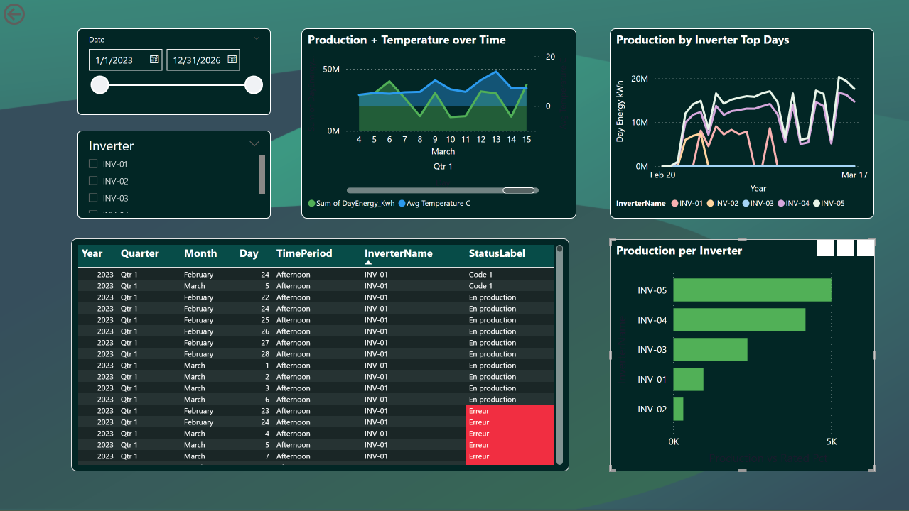
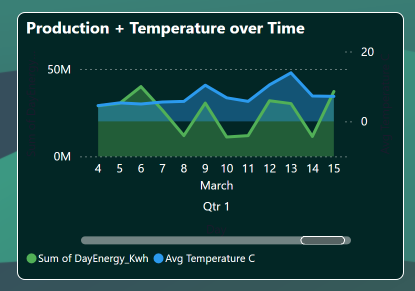
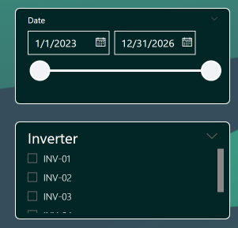
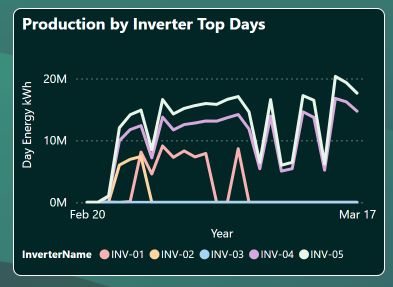
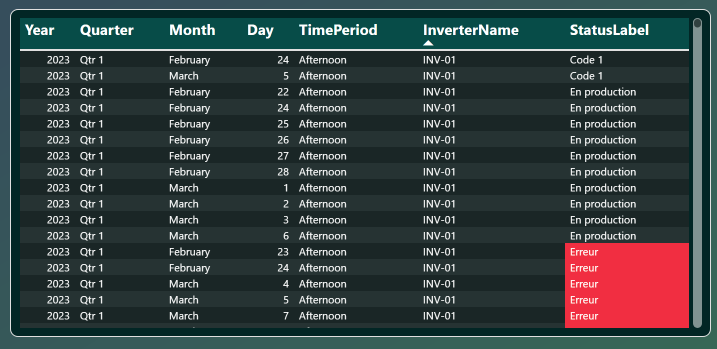
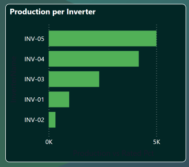

# User Handbook: Solar Production Dashboard

> Part of the [Solar Inverter Operations & Performance Dashboard](../README.md) project.  
> See also: [Energy & Financial Dashboard Guide](USER_HANDBOOK_ENERGY_FINANCIAL.md) · [Room Occupancy Dashboard Guide](USER_HANDBOOK_ROOM_OCCUPANCY.md) · [SAC Dashboard Guide](USER_HANDBOOK_SAC_DASHBOARD.md) · [Data Privacy & GDPR Statement](DATA_PRIVACY_GDPR.md) · [Technical Guide](TECHNICAL_GUIDE.md) · [Wiki](https://github.com/sandersdHES/ADF_DataCycleProject/wiki)

**Power BI Dashboard · Dark Mode · `Dashboard-Solar Production.pbix`**

---

This manual provides a detailed guide on how to navigate and interpret the **Solar Production** dashboard in Power BI. The interface uses a high-contrast **Dark Mode** designed for continuous monitoring sessions. It is primarily intended for technicians who need to track inverter health and energy output in real time.

The dashboard draws exclusively from `fact_solar_inverter` (5-minute inverter telemetry) joined with `dim_inverter`, `dim_inverter_status`, `dim_time`, and `dim_date`.

---

## 1. Data Controls & Navigation

The left-hand panel contains the primary tools for filtering the dashboard view.

### Time Frame Selector

A slider and calendar tool used to restrict the observation window. All visuals update simultaneously. The underlying field is `FullDate` from `dim_date`.

| View | Best used for |
|---|---|
| **Daily** | Fault investigation — trace an incident hour by hour |
| **Weekly** | Compare inverter output patterns across days |
| **Monthly** | High-level production review and reporting |

### Inverter Unit Selector

Individual toggle buttons for units `INV-01` through `INV-05`, mapped to `InverterName` from `dim_inverter`. Select a single inverter to isolate its data across all charts, or keep all selected to view total farm output.

---

## 2. Production & Environmental Correlation

The primary chart at the top overlays two time series: **daily energy output** and **ambient temperature**.

Both series are aggregated per time slot using the measures below.

| Series | Measure | Source |
|---|---|---|
| Energy output (kWh) | `Day Energy kWh` | `fact_solar_inverter → DayEnergy_Kwh` |
| Temperature (°C) | `Avg Temperature C` | `fact_solar_inverter` (temperature channel) |
| Time axis | `FullDate` / `TimePeriod` | `dim_date`, `dim_time` |

> **Operational Insight:** Under normal conditions, the two lines should follow a similar daily arc — production rises and falls with daylight and temperature. A significant divergence (high temperature, low output) is a primary indicator that a technical inspection is required.

---

## 3. Historical Production Rankings (Top Days)

The **Top Days** charts highlight the highest-producing intervals in the selected period. Each line is split by inverter colour so you can see each unit's contribution at a glance.

| Element | Data |
|---|---|
| Bar height | `SUM(fact_solar_inverter.DayEnergy_Kwh)` — total energy per day |
| Bar colour segments | `InverterName` from `dim_inverter` — one colour per inverter |
| X-axis | `FullDate` from `dim_date`, sorted descending by total energy |

> **Analysis:** If one inverter's colour segment appears disproportionately thin on the best production days, that unit was underperforming during peak irradiance. Use the Inverter Selector to isolate it and cross-reference with the incident log below.

---

## 4. Operational Log & Incident Tracking

The table at the bottom provides a granular record of every 5-minute sensor reading in the selected period. Each row is colour-coded by operating status.

| Column | Source | Meaning |
|---|---|---|
| Date / Time | `FullDate` (dim_date), `TimePeriod` (dim_time) | Timestamp of the reading |
| Inverter | `InverterName` (dim_inverter) | Which unit produced the reading |
| Status | `StatusLabel` (dim_inverter_status) | Operational state: Standby, Running, Error, Unknown |
| Failure flag | `IsFailure` (fact_solar_inverter) | 1 = fault state, 0 = normal |

| Row colour | Meaning |
|---|---|
| Green / Grey | Standard reading — system operating within expected parameters |
| **Red** | `IsFailure = 1` — fault logged, requires attention |

Each red entry identifies the exact timestamp and inverter name associated with the fault. Use the Inverter Selector and Time Frame Selector together to zoom in on a specific incident window.

---

## 5. Efficiency KPI

The bottom-right section compares actual output against the inverters' rated capacity using the `Production vs Rated Pct` measure. This is computed as actual AC power divided by the sum of rated peak power (`dim_inverter.RatedPower_kWp`) across the selected units.

---

## 6. Quick Diagnostic Procedure

Use this checklist when investigating a suspected fault:

1. **Check the Efficiency KPI** — a red indicator confirms system-wide underperformance.
2. **Scan the Incident Log** for red rows; note the timestamp and inverter name.
3. **Use the Inverter Selector** to isolate the unit reporting the fault.
4. **Cross-reference its output** against the Temperature Trend — if temperature was normal but production was low, the cause is likely hardware rather than weather.
5. **Compare against the Top Days chart** to see whether the fault day dropped out of the high-production ranking.

---

## 7. Connecting Power BI with your own login

Each user has a personal SQL login (e.g. `technician.jdoe`, `director.alopez`). Refresh the report with your own credentials so that the SQL row-level security applies correctly.

1. Open `dashboards/Dashboard-Solar Production.pbix` in Power BI Desktop.
2. Go to **Home → Transform data → Data source settings**.
3. Select the `sqlserver-bellevue-grp3.database.windows.net / DevDB` source and click **Edit Permissions → Edit…**
4. Switch the credential type to **Database** and enter your personal login and password.
5. Click **OK**, close, and **Refresh** the report.

> **Note:** The Solar Production dashboard contains no room-booking data. All roles (Technician, Director, Teacher) can see inverter telemetry and energy data. Technicians have the broadest access and are the primary audience for this dashboard.

### Demo accounts

Initial passwords are stored in Azure Key Vault `DataCycleGroup3Keys`. Retrieve them with `az keyvault secret show` if you have access, or ask your administrator.

| Username | Role | Key Vault secret |
|---|---|---|
| `technician.demo` | `Technician_Role` | `Technician-Demo-Password` |
| `director.demo` | `Director_Role` | `Director-Demo-Password` |

---

## Related Resources

- [Energy & Financial Dashboard Guide](USER_HANDBOOK_ENERGY_FINANCIAL.md) — financial and consumption overview dashboard
- [Room Occupancy Dashboard Guide](USER_HANDBOOK_ROOM_OCCUPANCY.md) — room utilization and scheduling dashboard
- [SAC Dashboard Guide](USER_HANDBOOK_SAC_DASHBOARD.md) — SAP Analytics Cloud inverter status overview
- [Data Privacy & GDPR Statement](DATA_PRIVACY_GDPR.md) — data protection measures and anonymization protocols
- [Technical Guide](TECHNICAL_GUIDE.md) — ETL pipeline, data schema, and ML lifecycle
- [Architecture Overview](ARCHITECTURE.md) — end-to-end system architecture
- [Power BI Dashboards](../dashboards/) — `.pbix` source files
- [Wiki](https://github.com/sandersdHES/ADF_DataCycleProject/wiki) — full browsable reference
